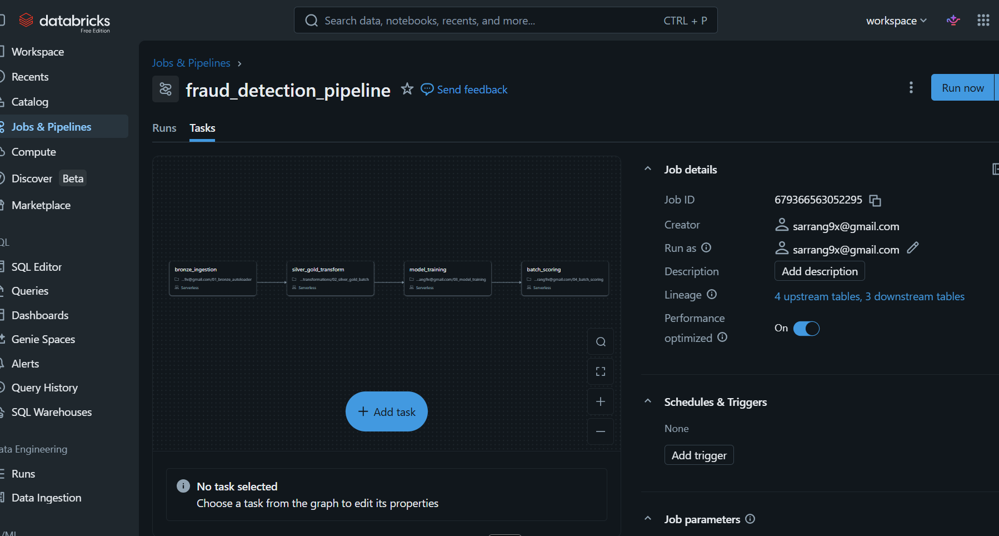
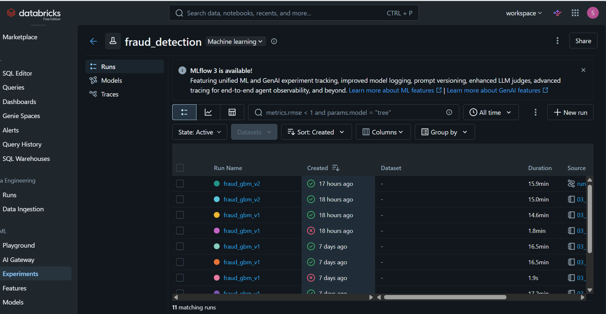
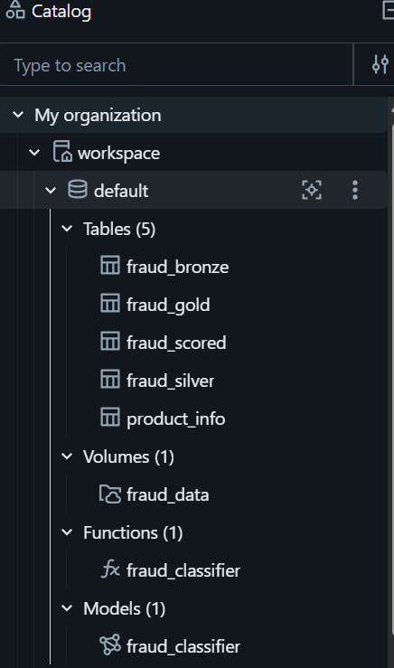
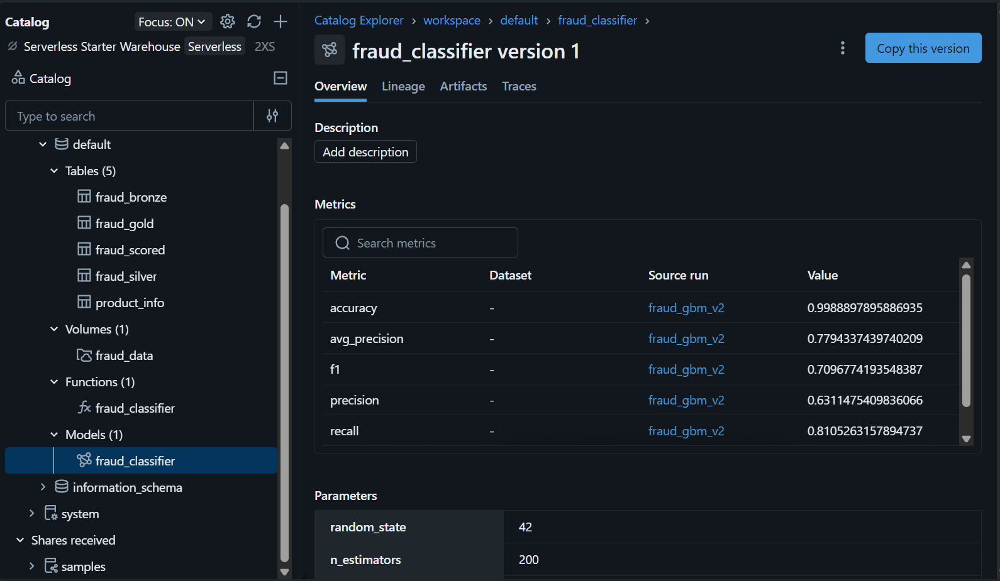

# Fraud Detection Pipeline — Databricks Medallion Architecture

An end-to-end fraud detection pipeline built on Databricks, implementing Medallion Architecture (Bronze → Silver → Gold) with Auto Loader ingestion, PySpark transformations, MLflow experiment tracking, Unity Catalog model registry, and orchestrated Databricks Jobs.

---

## Pipeline Run — All 4 Tasks Succeeded



---

## Architecture

```
Raw CSV (Databricks Volume)
    ↓
[01] Auto Loader (cloudFiles)
    ↓
Bronze Delta Table — fraud_bronze (284,807 rows)
    ↓
[02] PySpark Transformations + Data Quality Filters
    ↓
Silver Delta Table — fraud_silver (283,726 rows, 1,081 dropped by quality rules)
    ↓
[02] Feature Engineering
    ↓
Gold Delta Table — fraud_gold (283,726 rows, model-ready)
    ↓
[03] GradientBoostingClassifier + MLflow Tracking
    ↓
Unity Catalog Model Registry — fraud_classifier v1
    ↓
[04] Batch Scoring
    ↓
Scored Delta Table — fraud_scored (283,726 rows)
```

All 4 stages orchestrated as a single **Databricks Job** with sequential task dependencies.

---

## Dataset

[Kaggle Credit Card Fraud Detection](https://www.kaggle.com/datasets/mlg-ulb/creditcardfraud)

- 284,807 transactions, 492 fraud cases (0.17% positive class)
- 28 PCA-anonymized features (V1–V28), Amount, Time
- Severe class imbalance handled via sample weights

---

## Pipeline Components

### 01 — Bronze Layer: Auto Loader Ingestion
- Streaming ingestion using Databricks Auto Loader (`cloudFiles` format)
- Trigger: `availableNow` for batch-style incremental load
- Schema inference with checkpoint for schema evolution
- Raw data written as Delta table with full history preserved

### 02 — Silver & Gold Layers: Medallion Transforms
**Silver — Data Quality:**
- Type casting (Amount → double, Class → integer)
- Constraint filters: `Amount >= 0`, `Class IN (0, 1)`
- Deduplication and null removal on key columns
- 1,081 records dropped by quality rules

**Gold — Feature Engineering:**
- `Amount_log`: log-scaled transaction amount
- `Amount_scaled`: normalized amount (0–1 range)
- `high_value`: binary flag for transactions > $1,000
- `Time` column dropped (not predictive as raw feature)

### 03 — Model Training: MLflow Experiment Tracking
- Algorithm: Gradient Boosting Classifier (sklearn)
- Imbalance strategy: `compute_sample_weight(class_weight="balanced")`
- Preprocessing: `SimpleImputer(strategy="median")` in sklearn Pipeline
- All parameters, metrics, and model artifact logged to MLflow
- Model signature inferred and logged for Unity Catalog compatibility
- Registered to Unity Catalog Model Registry as `workspace.default.fraud_classifier`

### 04 — Batch Scoring
- Model loaded directly from Unity Catalog Registry (`models:/workspace.default.fraud_classifier/1`)
- Full Gold table scored with fraud probability and binary prediction
- Results written back to `fraud_scored` Delta table

---

## Model Performance

| Metric | Value |
|---|---|
| ROC-AUC | **0.9585** |
| Recall | **0.8105** |
| Average Precision | **0.7794** |
| F1 Score | 0.7097 |
| Precision | 0.6311 |
| Accuracy | 0.9989 |

Recall prioritized over precision — in fraud detection, missing actual fraud (false negative) is more costly than a false alarm.

---

## MLflow Experiment Tracking



---

## Unity Catalog — Delta Tables & Model Registry





---

## Tech Stack

| Component | Technology |
|---|---|
| Platform | Databricks Community Edition |
| Storage | Delta Lake (Unity Catalog) |
| Ingestion | Auto Loader (cloudFiles) |
| Transformation | PySpark (DataFrame API) |
| ML | scikit-learn (GradientBoostingClassifier) |
| Experiment Tracking | MLflow |
| Model Registry | Unity Catalog Model Registry |
| Orchestration | Databricks Jobs (multi-task) |
| Language | Python 3.12 |

---

## Job Run Summary

| Task | Status | Duration |
|---|---|---|
| bronze_ingestion | ✅ Succeeded | ~34s |
| silver_gold_transform | ✅ Succeeded | ~1m |
| model_training | ✅ Succeeded | ~15m |
| batch_scoring | ✅ Succeeded | ~3m |
| **Total** | **✅ Succeeded** | **18m** |

---

## Repository Structure

```
fraud-detection-databricks/
├── notebooks/
│   ├── 01_bronze_autoloader.py      # Auto Loader ingestion → Bronze Delta table
│   ├── 02_silver_gold_batch.py      # Medallion transforms → Silver & Gold Delta tables
│   ├── 03_model_training.py         # MLflow training + model registration
│   └── 04_batch_scoring.py          # Batch scoring from Model Registry
├── screenshots/
│   ├── pipeline_run.png             # Databricks Job — all 4 tasks green
│   ├── mlflow_experiments.png       # MLflow experiment runs UI
│   ├── delta_tables.png             # Unity Catalog — all Delta tables
│   └── model_registry.png          # fraud_classifier v1 in Model Registry
└── README.md
```

---

## Setup & Reproduction

**Prerequisites:**
- Databricks Community Edition account
- Kaggle account (to download `creditcard.csv`)

**Steps:**
1. Download `creditcard.csv` from [Kaggle](https://www.kaggle.com/datasets/mlg-ulb/creditcardfraud)
2. Upload to Databricks Volume: `Catalog → Add → Upload files to volume` → create volume `fraud_data`
3. Update email path in `03_model_training.py`: `mlflow.set_experiment("/Users/your_email/fraud_detection")`
4. Run notebooks in order (01 → 02 → 03 → 04), or configure as a Databricks Job
5. View results in `Experiments` (MLflow UI) and `Catalog` (Delta tables + Model Registry)

---

## Key Interview Talking Points

- Implemented **Medallion Architecture** with explicit data quality enforcement between layers — 1,081 records dropped by Silver constraints
- Used **Auto Loader** with `availableNow` trigger for incremental, idempotent ingestion — production pattern for streaming pipelines
- Logged model with **MLflow signature** for Unity Catalog compatibility — required for enterprise model governance
- Handled **severe class imbalance** (0.17% fraud rate) via sample weights rather than oversampling — avoids data leakage
- Pipeline achieves **ROC-AUC 0.9585** and **81% recall** on held-out test set
- Full pipeline orchestrated as a **Databricks Job** with sequential task dependencies and lineage tracking (4 upstream, 3 downstream tables)
